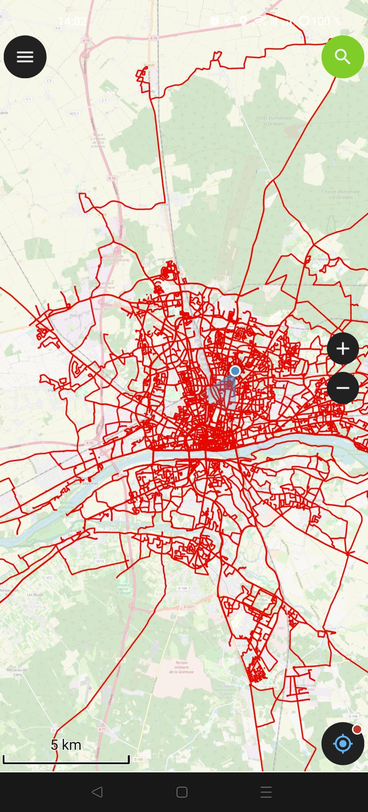

# panoramax-tools

## Visualiser les tracés Panoramax sur son smartphone avec QField (QGIS pour mobile).

Projet QGIS avec couche Panoramax **simple**:
[couche panoramax](https://github.com/u4y0u/panoramax-tools/blob/main/couche%20panoramax%20QGIS.qgz)

Projet QGIS avec couche Panoramax et **tracking GPS**.
[couche panoramax avec tracking](https://github.com/u4y0u/panoramax-tools/blob/main/couche%20panoramax%20QGIS%20with%20tracking%20session.qgz)

Projet QGIS avec couche Panoramax **haute visibilité**:
[couche panoramax haute visibilité](https://github.com/u4y0u/panoramax-tools/blob/main/couche%20panoramax%20QGIS%20haute%20visibilit%C3%A9.qgz)

Projet QGIS avec couche Panoramax **haute visibilité avec tracking**:
[couche panoramax haute visibilité avec tracking]()

## Liens
site **[QField](https://www.qfield.org/)**

[application sur APKPure](https://apkpure.com/qfield-for-qgis/ch.opengis.qfield)

[application sur le Playstore](https://play.google.com/store/apps/details?id=ch.opengis.qfield)
